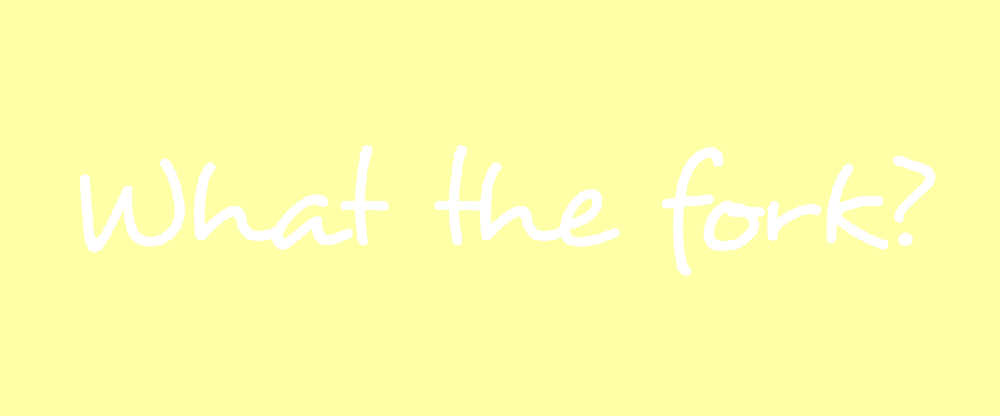

# Fork-Puns
Add your Forking funny puns

Go check out the website [here](https://cutwell.github.io/What-The-Fork/) to get a random fork pun (or an Easter egg ;D).

Tweet your pun on the #Hacktoberfest and #WhatTheFork hashtags for... some forking banter.

---

---

### Contributing
Fork this project and add your fork-related pun(s?) + a profile link to the list below, then make a Pull Request to add your contributions to this repository like so...

Note: Fork-puns including profanity will be deleted.

```markdown
 - [Fork off](https://github.com/Cutwell)
```

### Puns
 - [Fork off](https://github.com/Cutwell)
 - [What the fork?](https://github.com/Cutwell)
 - [Go the fork to sleep](https://github.com/Cutwell)
 - [Fork you I won't do what you tell me!](https://github.com/Cutwell)
 - [Fork my life](https://github.com/gerd2002)
 - [Sooner or later, we all encounter a fork in our lives](https://github.com/Zumza123/)
 - [LMFFO - Laugh My Forking Fork Out](https://github.com/IOAyman)
 - [Forkin' add me](https://github.com/Charllo)
 - [Fork you!](https://github.com/gerd2002)
 - [Fork happens](https://github.com/rkruk)
 - [Some things are so forking stupid](https://github.com/RajPathare)
 - [Stay calm and fork on!](https://github.com/rmartin5)
 - [May the Fork be with you](https://github.com/wouterjanson)
 - [Fork yeah!](https://github.com/gregorymarchese)
 - [That's Forked Up!](https://github.com/gregorymarchese)
 - [These aren't the droids you are looking fork](https://github.com/vjuneja)
 - [Fork Ro Dah!](https://github.com/tomsotte)
 - [Get me a fork'n knife please](https://github.com/thatguywiththatname)
 - [Go fork yourself](https://github.com/raynescc)
 - [You forkgot about this one](https://github.com/dbrereton1995)
 - [Unforkgivable!](https://github.com/yuibun)
 - [Fork, I always forket the punchline!](https://github.com/MyNameNoneOfYourBusiness)
 - [spooning or forking; which do you prefer?](https://github.com/anzcarroll)
 - [Oh for forks sake!](https://github.com/anzcarroll)
 - [Unfork my wine](https://github.com/zhaks)
 - [Are u Forking kiddin' me](https://github.com/zzz1234)
 - [Fork this code, man!](https://github.com/starsky135)
 - [How unforktunate!](https://github.com/Kalaborative)
 - [Forking sheet](https://github.com/sanik90)
 - [Fork lifting](https://github.com/NicoPennec)
 - [Zero forks given](https://github.com/kbeflo)
 - [What the fork is for dinner?](https://github.com/ganes1410)
 - [SNAFU - situation normal, all forked up](https://githib.com/ablewhite)
 - [All your fork are belong to us](https://github.com/wouterjanson)
 - [So long and thanks for all the forks!](https://github.com/KatSaldivar)
 - [This is a mugging. Now fork it over!](https://github.com/shikhar96)
 - [Get the fork outta here!](https://github.com/AshBardhan)
 - [Github Motherforker! Do you speak it?](https://github.com/AshBardhan)
 - [Forkive, but never Forket](https://github.com/AshBardhan)
 - [Uptown fork gon' give it to ya](https://github.com/AshBardhan)
 - [Listen up kid: Everyone's scared of their first fork](https://github.com/batraman)
 - [Fork. James Fork.](https://github.com/MaaikeVR)
 - [FUBAR: Forked up beyond any Recognition](https://github.com/gregorymarchese)
 - [Forkiveme](https://github.com/piscue)
 - [Meet the Forkers](https://github.com/Markandeya)
 - [Look at all these forks I give](https://github.com/DugTrio91)
 - [Spider-man and the Fantastic Fork](https://github.com/xit4)
 - [The weather is fork-ast to be great! Lots of punshine.](https://github.com/licsth)
 - [I Forking love life](https://github.com/mgnc2867)
 - [When you come to a Fork in the road... Take it!](https://github.com/mgnc2867)
 - [The Fork Awakens](https://github.com/LyNac)
 - [In a world full of spoons, be a Fork.](https://github.com/qayla-c)
 - [Spoon this repo](https://github.com/wouterjanson)
 - [Git the fork outta here!](https://github.com/SirDaev)
 - [Fan-forking-tastic.](https://github.com/jppferguson)
 - [I'm forking here! I'm forking here!](https://github.com/NiallEccles)
 - [This is my forking awful pun](https://github.com/Apathyy)
 - [I don't give a Fork!](https://github.com/codepnkj)
 - [You Forkin' to Me ?](https://github.com/danedavid)
 - [One Fork to rule them all](https://github.com/zburchett)
 - [It's Foooork Ceeena!](https://github.com/DarkSiderOC)
 - [Unforkgivable!](https://github.com/leboeufj)
 - [How the fork do I add one?](https://github.com/Apathyy)
 - [Feel the Fork, Luke](https://github.com/AgentShir)
 - [You're Fork'n kidding me!](https://github.com/marconmbrito)
 - [One stab, Fork holes](https://github.com/dome2034)
 - [Are you forking kidding me!](https://github.com/WindThrownLogic)
 - [That knife performance was very sharp but that fork did everything prong.](https://github.com/Milleus)
 - [Accept my forking pull request! #hacktoberfest](https://github.com/laurendimitra)
